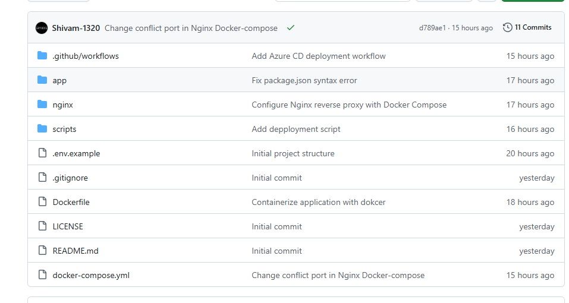
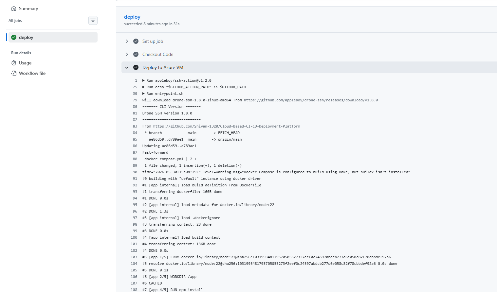
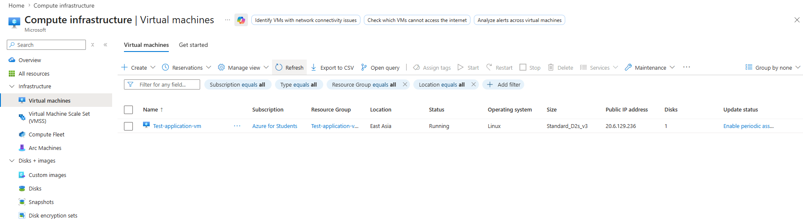
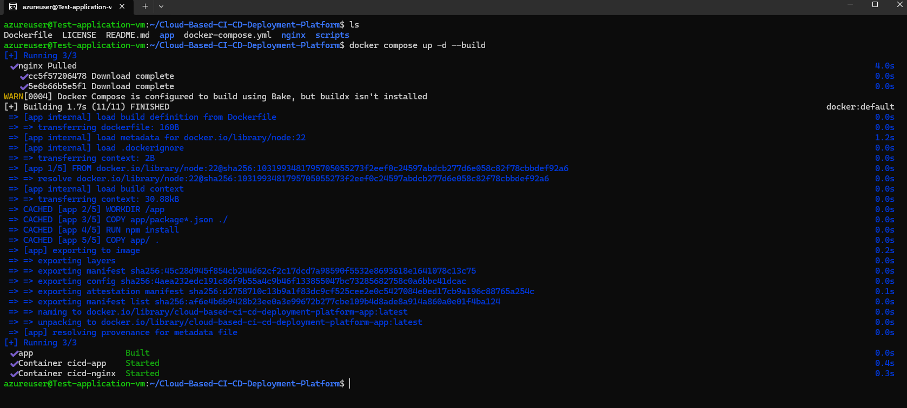
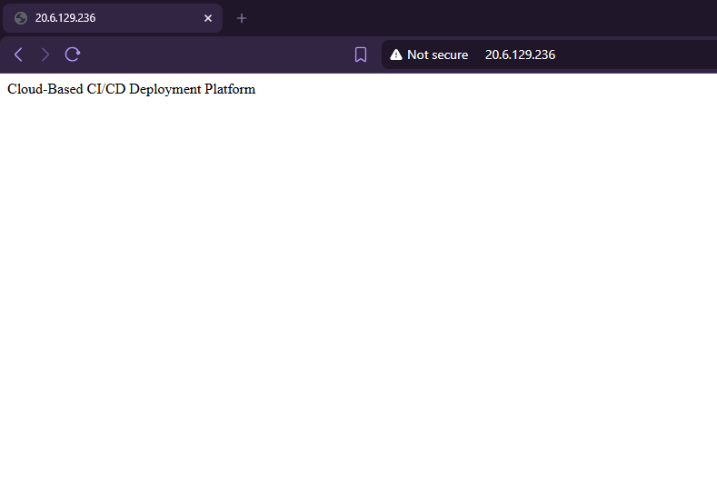

#  Production Web Application CI/CD Platform

##  Overview

This project demonstrates a complete CI/CD pipeline for deploying a containerized Node.js application to an Azure Ubuntu Virtual Machine using GitHub Actions, Docker Compose, and Nginx Reverse Proxy.

When code is pushed to the GitHub repository, GitHub Actions automatically deploys the latest version of the application to the Azure VM via SSH.

##  Architecture Diagram


---

##  CI/CD Workflow

```text
Developer
    │
    │ Git Push
    ▼
GitHub Repository
    │
    │ Trigger Workflow
    ▼
GitHub Actions CI/CD
    │
    │ SSH Deployment
    ▼
Azure Ubuntu VM
    │
    ├── Docker Engine
    ├── Docker Compose
    ├── Nginx Reverse Proxy (Port 80)
    └── Node.js Application Container (Port 3000)

Internet Users
    │ HTTP:80
    ▼
Nginx Reverse Proxy
    │ Proxy Pass
    ▼
Node.js Application
```

---

##  Technologies Used

| Technology     | Purpose                 |
| -------------- | ----------------------- |
| GitHub         | Source Code Management  |
| GitHub Actions | CI/CD Automation        |
| Azure VM       | Application Hosting     |
| Ubuntu Linux   | Operating System        |
| Docker         | Containerization        |
| Docker Compose | Container Orchestration |
| Nginx          | Reverse Proxy           |
| Node.js        | Application Runtime     |
| SSH            | Secure Deployment       |

---

##  Repository Structure

```bash
.
├── .github/
│   └── workflows/
│       └── deploy.yml
│
├── app/
│   ├── package.json
│   └── application source code
│
├── nginx/
│   └── nginx.conf
│
├── scripts/
│   └── deploy.sh
│
├── Dockerfile
├── docker-compose.yml
├── .env.example
├── .gitignore
├── LICENSE
└── README.md
```

---

##  Docker Architecture

### Nginx Reverse Proxy

* Receives incoming HTTP requests on Port 80
* Routes traffic to the Node.js application container
* Acts as the public entry point for users

### Node.js Application Container

* Runs the web application
* Listens internally on Port 3000
* Receives traffic from Nginx

---

## ⚙️ Deployment Process

### 1. Clone Repository

```bash
git clone https://github.com/YOUR_USERNAME/YOUR_REPOSITORY.git
cd YOUR_REPOSITORY
```

### 2. Build Containers

```bash
docker compose build
```

### 3. Start Containers

```bash
docker compose up -d
```

### 4. Verify Running Containers

```bash
docker ps
```

### 5. Check Logs

```bash
docker compose logs -f
```

---

##  GitHub Actions Deployment Workflow

The CI/CD pipeline performs the following steps automatically:

1. Developer pushes code to GitHub.
2. GitHub Actions workflow is triggered.
3. SSH connection is established to Azure VM.
4. Latest code is pulled from the repository.
5. Docker image is rebuilt.
6. Docker Compose recreates containers.
7. Application is deployed successfully.

---

##  Screenshots

### GitHub Repository



### GitHub Actions Workflow



### Azure Virtual Machine


### Docker Containers



### Running Application



---

##  Access Application

```text
http://YOUR_SERVER_IP
```

Example:

```text
http://20.xx.xx.xx
```

---

##  Environment Variables

Example `.env` file:

```env
PORT=3000
NODE_ENV=production
```

---

##  Skills Demonstrated

* Linux Administration
* Azure Virtual Machines
* Docker Containerization
* Docker Compose
* Nginx Reverse Proxy
* GitHub Actions CI/CD
* SSH Automation
* Production Deployment
* Troubleshooting and Monitoring

---

##  Future Improvements

* HTTPS using Let's Encrypt
* Domain Name Integration
* Docker Registry Integration
* Health Checks
* Monitoring with Prometheus
* Grafana Dashboards
* Blue-Green Deployment Strategy

---

## 👨‍💻 Author

**Pankaj**

Currently learning AWS, DevOps, Cloud Infrastructure, and Automation.
